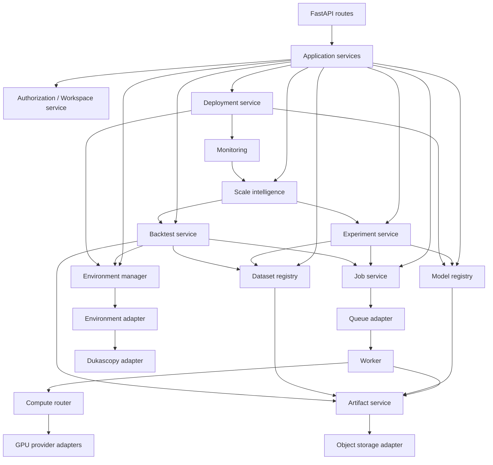

# Component Relationships and Connections

This document defines ownership, direction of calls, and data passed between major components.

## 1. Relationship diagram

## 2. Ownership and responsibilities

| Component | Owns | Must not own |
|---|---|---|
| API routes | HTTP schemas, status codes, request/response mapping | Training logic, provider-specific logic, large file processing |
| Authorization/workspaces | Identity integration, membership, role/resource checks | Model execution |
| Experiment service | Experiment specification and run relationships | GPU provider API calls |
| Model registry | Model metadata, revisions, artifact links, source/license metadata | Binary weight storage itself |
| Dataset registry | Dataset metadata, versions, schema, source/license and validation state | Full dataset bytes in PostgreSQL |
| Job service | Job state machine, attempts, cancellation requests, progress/log references | Provider-specific job API details |
| Queue adapter | Enqueue/dequeue/ack/retry mechanics | Business policy for experiments |
| Worker | Job execution, heartbeat, progress, cooperative cancellation, artifact production | Public HTTP request lifecycle |
| Compute router | Provider selection and normalized compute lifecycle | Experiment semantics or model registry ownership |
| GPU provider adapter | Provider-specific API mapping | Direct writes to unrelated business tables |
| Artifact service | Object keys, checksums, upload/download authorization, retention metadata | User-facing experiment policy |
| Storage adapter | Put/get/head/delete/list and temporary access abstraction | Dataset/model business rules |
| Environment manager | Environment registry and capability discovery | Broker execution unless explicitly modeled separately |
| Environment adapter | Provider-specific data retrieval and normalization | Core experiment state |
| Backtest service/engine | Reproducible simulation and trading/domain metrics | Actual live orders |
| Scale intelligence | Estimates, uncertainty, recommendations and calibration records | Unsubstantiated certainty or fabricated evidence |
| Deployment service | Release/deployment state and configuration references | Silent mutation of trained model artifacts |
| Monitoring | Runtime/domain measurements and actual outcomes | Rewriting original experiment records |

## 3. Main interaction contracts

### Experiment creation

1. API authenticates user and authorizes workspace access.
2. Experiment service validates the specification.
3. Model and dataset registries resolve explicit versions.
4. Experiment service stores a reproducible immutable snapshot/reference of the configuration.
5. Job service creates a queued job linked to the experiment/run.
6. Queue adapter dispatches the job.
7. API returns a job/run identifier without waiting for training to finish.

### Job execution

1. Worker claims a job and records an attempt/heartbeat.
2. Compute router chooses a provider based on required capabilities, region/data locality if known, availability, and configured cost policy.
3. Worker obtains authorized short-lived object access and downloads required artifacts.
4. Worker runs the method in an isolated workspace.
5. Worker periodically writes progress and log references and checks cancellation.
6. Outputs are uploaded through the artifact service.
7. Job service records final status, artifact references, metrics, timestamps, and provider metadata.
8. Retry behavior must be explicit and safe for each job type.

### Dataset/model registration

- The backend creates a metadata record first or coordinates a pending upload session.
- Upload is authorized with a short-lived URL or equivalent scoped mechanism.
- After upload, verify object existence and, where feasible, checksum/size/type.
- Mark the version ready only after validation succeeds.
- Object keys must be generated by the backend; do not trust user-provided paths as storage keys.
- Keep immutable versions; changing a dataset/model creates a new version rather than silently replacing the old artifact.

### Backtest

- Backtest references an exact strategy/model version, dataset or market-data version, time range, instrument, timeframe/tick granularity, and simulation assumptions.
- Historical replay and simulation are separate from live order execution.
- Persist summary metrics in PostgreSQL; store large trade lists, tick replay files, and exports in object storage when appropriate.
- A backtest result must be reproducible from its stored configuration and input versions.

### Scale intelligence

- Inputs are completed experiment runs and evaluation/backtest results with comparable metrics.
- Output includes prediction, metric definition, training/compute scale variables, evidence count, uncertainty/confidence interval where supported, assumptions, and limitations.
- If data is insufficient or outside the observed regime, return “insufficient evidence” or a clearly qualified estimate.
- Store predictions separately from actual outcomes so calibration can be measured later.

### Deployment and monitoring

- Deployment references an immutable model/artifact version and a declared runtime/environment.
- Monitoring records operational health and domain-specific outcome metrics separately.
- Actual results should be linked to the prediction or deployment version that produced them.
- Deployment must not imply brokerage connectivity or live trading permission.

## 4. Cross-cutting rules

- All resource access is workspace/tenant authorized.
- Provider-specific code stays behind adapters.
- Large files are moved through object storage, not passed through API memory.
- Long-running work runs in workers.
- Use idempotency keys or deduplication for job submission and artifact finalization where appropriate.
- State transitions are explicit and validated.
- Errors are typed and actionable; unsupported provider capabilities are not silently emulated.
- Audit security-sensitive operations and lifecycle transitions.
