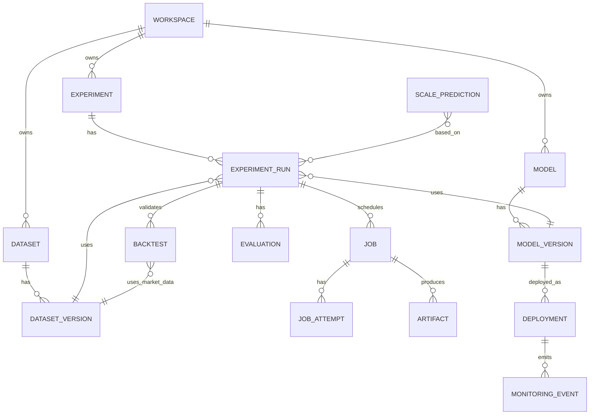
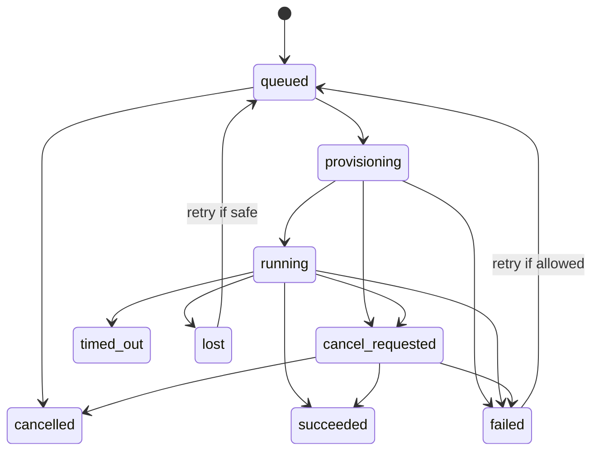

# Data and API Contracts

These are initial domain contracts, not a claim that the existing frontend already uses these exact fields. Inspect the frontend's actual pages, types, and mock services before finalizing API compatibility.

## 1. Core entity relationships

## 2. Minimum entities

- **Workspace:** id, name, owner/organization reference, status, timestamps.
- **Membership:** workspace id, user id, role, status.
- **Experiment:** id, workspace id, name, description, domain/environment, status, created_by, timestamps.
- **ExperimentRun:** id, experiment id, immutable configuration snapshot, model-version reference, dataset-version reference, method, status, started/completed timestamps, metrics summary.
- **Model:** id, workspace/visibility, name, source type, source URI, license/provenance metadata, created_by.
- **ModelVersion:** id, model id, revision, artifact reference or external reference, checksum if locally stored, format, status, metadata.
- **Dataset:** id, workspace/visibility, name, source type, license/permission metadata, created_by.
- **DatasetVersion:** id, dataset id, external provider/source identifier, immutable revision, provider-relative file path, schema/format and size when known, checksum where available, validation status, lineage. In V1, this is a reference to provider-owned data, not a platform dataset-file artifact. The first runnable method currently requires a pinned Hugging Face revision; Kaggle references remain registration-only.
- **Artifact:** id, workspace id, owner resource type/id, object key, size, content type, checksum, artifact type, retention class, created_at.
- **Job:** id, workspace id, run id, required output artifact id, job type, status, cancellation state, progress, timestamps, current attempt.
- **JobAttempt:** id, job id, provider id, provider job id, status, start/end times, failure code, usage metadata.
- **Evaluation:** id, run id, metric schema, metrics, evaluation configuration, artifact references.
- **Backtest:** id, run/model/strategy reference, market-data version, instrument, range, assumptions, metrics summary, status, output references.
- **ScalePrediction:** id, metric/target, input experiment/run references, method/version, estimate, uncertainty, assumptions, created_at.
- **Deployment:** id, workspace id, model version, environment/runtime, mode, status, configuration, created_at.
- **MonitoringEvent:** deployment id, timestamp, operational/domain metrics, prediction reference and actual outcome when available.
- **AuditEvent:** actor, workspace, action, resource reference, timestamp, safe metadata.

Use UUIDs or another consistent non-guessable identifier strategy. Define timestamps in UTC. Apply workspace ownership and authorization at the repository/service layer, not just in the UI.

## 3. API conventions

- Use versioned routes such as `/api/v1/...`.
- Use Pydantic models for request/response validation.
- Return consistent error shapes with a stable error code, human-readable message, and request/correlation ID.
- Use pagination for collections.
- Use idempotency for job submission and upload finalization where appropriate.
- Keep synchronous API calls short. Job submission returns immediately with a resource identifier and current status.
- Define API contracts from actual frontend needs after inspecting the existing frontend repository. Avoid generating endpoints solely because a module name exists.

Illustrative endpoints:
- `POST /api/v1/workspaces/{workspace_id}/experiments`
- `GET /api/v1/workspaces/{workspace_id}/experiments`
- `POST /api/v1/workspaces/{workspace_id}/experiments/{experiment_id}/runs`
- `GET /api/v1/workspaces/{workspace_id}/jobs/{job_id}`
- `POST /api/v1/workspaces/{workspace_id}/jobs/{job_id}/cancel`
- `GET /api/v1/workspaces/{workspace_id}/jobs/{job_id}/logs`
- `POST /api/v1/workspaces/{workspace_id}/datasets` (register an external dataset reference; no dataset-file upload in V1)
- `POST /api/v1/workspaces/{workspace_id}/datasets/{dataset_id}/versions` (register a new external provider revision)
- `POST /api/v1/workspaces/{workspace_id}/artifacts/upload-authorizations`
- `POST /api/v1/workspaces/{workspace_id}/artifacts/{artifact_id}/finalize`
- `POST /api/v1/workspaces/{workspace_id}/artifacts/{artifact_id}/download-authorization`
- `GET /api/v1/models`
- `GET /api/v1/environments`
- `POST /api/v1/backtests`
- `GET /api/v1/backtests/{backtest_id}`

These are examples for contract design, not a mandate to implement all endpoints in the first milestone.

## 4. Job state contract

A cancellation request is not proof the provider has stopped. Keep `cancel_requested` until confirmed. A job may finish successfully if it completes before cancellation takes effect. Preserve attempt history.

## 5. Artifact and object-key rules

- Object keys are generated by the backend, scoped by workspace and resource, and must not contain raw user-supplied filesystem paths.
- Browser/worker access is granted only through scoped short-lived authorization.
- Do not store permanent object credentials in the frontend.
- For V1, do not issue dataset-file upload authorizations or store copies of externally hosted user datasets. Dataset references become `ready` after available source/revision metadata and permissions are validated; verify the downloaded revision during job setup when supported.
- Validate upload size, content type, checksum where available, and resource authorization before marking a model artifact/output ready.
- A platform-stored model version becomes `ready` only after its uploaded artifact has been verified. Externally hosted model versions may remain references.
- Store the provider and bucket/container configuration in backend configuration, not in business logic.
- Retention class examples: `final_model`, `intermediate_checkpoint`, `temporary_job_output`, `logs`, `export`. Temporary GPU-worker dataset copies are scratch data and must be deleted after the job, including failure/cancellation cleanup.
- Retention policy must be configurable and auditable.

## 6. Metrics and scale-prediction contracts

Metric records should include a stable metric key, value, unit where applicable, evaluation configuration, input version references, and timestamp. Avoid comparing results whose metric definitions or evaluation conditions differ without explicit normalization.

A scale prediction should include:
- target metric and predicted value;
- scale variables and units;
- model/method used and version;
- evidence runs used;
- uncertainty estimate or an explicit statement that uncertainty could not be estimated;
- assumptions and extrapolation range;
- timestamp and eventual actual outcome reference.

Never report false precision or a confidence interval that the chosen method cannot support.
