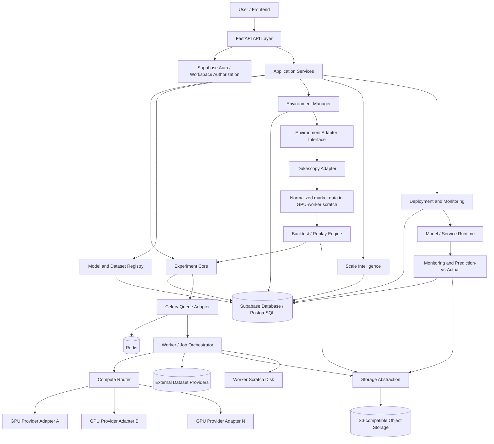

# System Architecture

## 1. Whole-system view

## 2. Lifecycle / data flow

```mermaid
flowchart LR
    A[Create experiment spec] --> B[Validate inputs and permissions]
    B --> C[Resolve model + dataset versions]
    C --> D[Plan job and estimate resources]
    D --> E[Queue asynchronous job]
    E --> F[Select compute provider]
    F --> G[Worker downloads referenced dataset to temporary GPU storage]
    G --> H[Run method / evaluation]
    H --> I[Upload final model weights and retained outputs to object storage]
    I --> J[Verify artifacts, remove temporary data, release GPU, persist status]
    J --> K[Evaluate and compare runs]
    K --> L[Scale prediction / recommend next experiment]
    K --> M[Backtest or environment validation]
    M --> N[Deployment approval / release]
    N --> O[Monitor actual outcomes]
    O --> P[Compare predicted vs actual and recalibrate]
```

## 3. Trust boundaries

- The frontend is not trusted to authorize object access, provider access, workspace membership, or job operations.
- FastAPI authenticates the caller and checks workspace/resource permissions before creating signed object URLs or scheduling work.
- Workers receive only the inputs and job-scoped provider authorization required for a specific job. V1 external datasets are fetched to temporary GPU-worker storage and are not copied to platform object storage.
- Object storage is private by default. Never expose permanent provider credentials to the browser.
- GPU provider credentials and environment credentials live in a secrets manager or deployment environment, not in Git.
- Environment adapters are responsible for translating provider-specific data into internal contracts; core services should not consume provider-specific response shapes directly.

## 4. Infrastructure responsibilities

- **FastAPI:** request validation, authentication integration, authorization, API responses, job submission and status queries.
- **Supabase Database:** durable relational state and metadata, backed by PostgreSQL.
- **Queue:** Celery dispatches background work through Redis; job state and attempt history remain in Supabase Database. Do not assume FastAPI background tasks are suitable for GPU workloads.
- **Workers:** execute jobs outside API processes, fetch external dataset references to temporary GPU-worker storage, report progress, stream/record logs, handle cancellation cooperatively, upload final model weights and retained outputs to object storage before GPU release, and clean temporary data on every exit path.
- **Compute router:** chooses a compatible provider, maps a normalized job request to provider-specific operations, and records provider job identifiers and cost/usage when available.
- **Object storage:** S3-compatible storage for durable final model weights and other retained platform-generated binary artifacts and large outputs; not a V1 mirror for externally hosted user datasets.
- **Storage adapter:** stable internal interface for object operations and temporary access.
- **Environment manager:** lists registered environments and capabilities; routes environment-specific operations to adapters.
- **Dukascopy adapter:** only the verified capabilities required for V1; document any library/API, terms, data limits, and live-data restrictions.
- **Backtest engine:** deterministic replay/simulation over versioned historical inputs. It must not imply live execution.
- **Scale intelligence:** uses recorded experiments and evaluations; returns estimates with evidence, assumptions, and uncertainty.
- **Monitoring:** records operational metrics and domain outcome metrics, then supports prediction-versus-actual analysis.

## 5. Recommended deployment shape for V1

Start with separately runnable processes, even if initially deployed on a small number of servers:

1. API service.
2. Worker service.
3. Supabase Database (PostgreSQL).
4. Redis broker for Celery.
5. S3-compatible object storage.
6. Optional monitoring/log aggregation.

Do not require GPU providers to mount the API server's disk. Do not keep a training job alive inside an HTTP request. Scale API and workers independently.

## 6. Important failure paths

- API accepted job but queue dispatch failed: use a durable state transition/outbox or retry-safe dispatch strategy.
- Worker disappears: mark the attempt as lost/failed after a heartbeat timeout and allow safe retry if the job type is idempotent.
- Upload succeeds but DB commit fails: make artifacts discoverable/orphan-cleanable; avoid falsely marking a job complete.
- Cancellation requested: persist the request, forward it to the worker/provider when supported, and report `cancel_requested` until confirmed.
- Provider lacks cancellation or log streaming: represent capability limitations explicitly.
- Data source is unavailable or licensing/capability is uncertain: return a clear unsupported/unavailable state rather than fake data.
- External dataset download fails or its requested revision cannot be verified: fail the job clearly and clean up temporary files. Do not mark a run successful until required model artifacts are durably uploaded and verified; always clean up/release GPU resources after success or failure.
